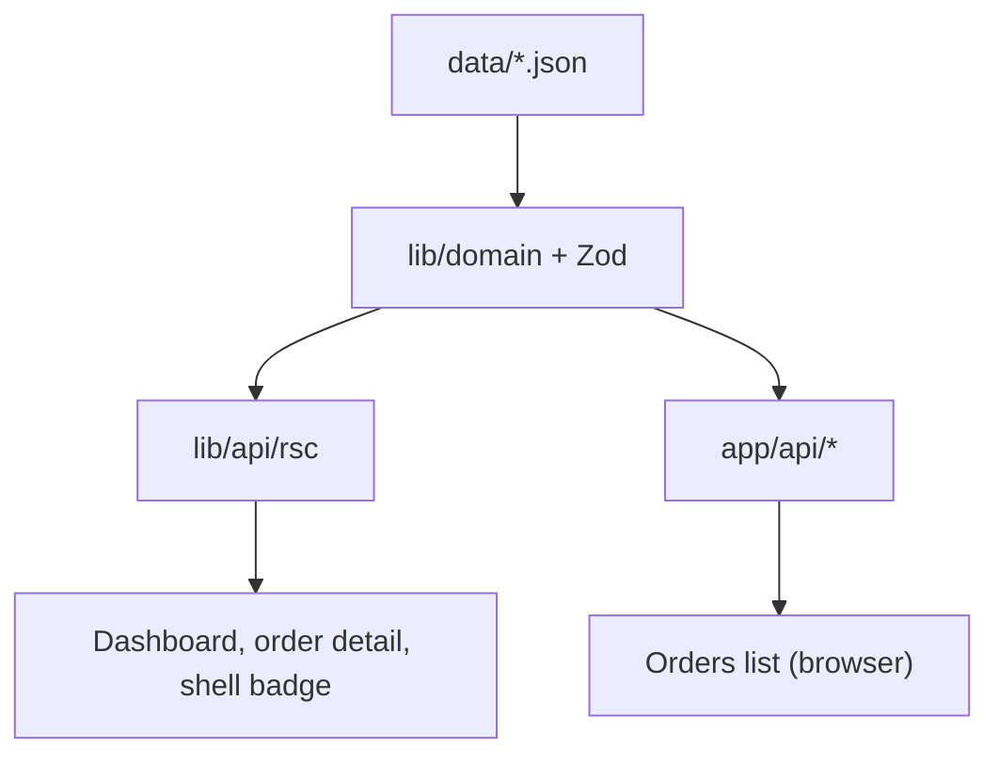

# Architecture

How the Production Analytics Dashboard is structured and why.  
Setup and demo links: [README](../README.md).

---

## Core idea: one domain, two access paths

**`lib/domain`** is the single place that:

- reads and validates sample data (Zod),
- calculates KPIs and chart series,
- filters and paginates orders.

Screens never import JSON (or any storage) directly. They reach the domain through **one of two access paths**, chosen by how the screen behaves:

| Path | Used by | Mechanism |
| --- | --- | --- |
| Server helpers (`lib/api/rsc`) | Dashboard, shell order count, order detail | Server Component calls the domain **in-process**. No HTTP request to `/api`. |
| HTTP API + TanStack Query | Orders list (filters + table) | Browser calls `GET /api/orders`. The route handler calls the **same** domain. |

Same rules and numbers — two entry points, not two business layers.



### Why two paths?

| Approach | Problem |
| --- | --- |
| HTTP `/api` for every page | Server pages would fetch their own app over the network. That failed on Vercel in practice and adds latency for first paint on read-once pages. |
| Server helpers only | The Orders list needs frequent filter changes, URL sync, caching, and keeping previous rows while loading. That fits TanStack Query, which needs a normal client-facing API. |

Split by job:

- **Read-once pages** → `lib/api/rsc`
- **Interactive filtered list** → `/api` + TanStack Query

### If storage were a database

The screen-level pattern above **stays the same**. What changes is the layer under `lib/domain`: file reads become a repository or ORM against a database. Filtering and pagination may move into SQL as data grows. Route handlers and `lib/api/rsc` remain thin adapters over the domain.

---

## Dashboard (server path)

1. User opens `/`.
2. The server runs the page (and shell layout).
3. The page calls `getAnalytics()`, `getOrders()`, and `getActivities()` from `lib/api/rsc`.
4. Those helpers call `lib/domain`, which reads JSON and builds KPIs, series, and lists.
5. Data is passed into components as props.

The Dashboard does **not** call `fetch("/api/analytics")`. That route exists and uses the same domain, but the homepage uses the server helpers.

The shell layout also uses `getAnalytics()` for the Orders badge. React `cache()` deduplicates that work per request.

---

## Orders list (API path)

1. User opens `/orders` (filters may be in the URL).
2. The page shell can still use `lib/api/rsc` for a small total badge.
3. `OrdersWorkspace` runs in the browser as a Client Component (with `QueryProvider`).
4. Filters (`q`, `status`, `from`, `to`, `page`) live in the URL.
5. TanStack Query fetches when that URL state changes.
6. The client helper calls `GET /api/orders?...`.
7. The route handler runs the same domain logic and returns JSON.
8. The table renders the response; previous rows stay visible while refetching.

Search input debounces (~300ms) before updating the URL so every keystroke does not trigger a fetch.

Order detail (`/orders/[id]`) uses the **server path** again — like the Dashboard, not like the list.

| Screen | Path |
| --- | --- |
| Dashboard `/` | Server (`lib/api/rsc`) |
| Orders badge in sidebar | Server (`lib/api/rsc`) |
| Orders list `/orders` | API + TanStack Query |
| Order detail `/orders/[id]` | Server (`lib/api/rsc`) |

TanStack Query is scoped to the orders list workspace, not the whole app.

---

## Folders

```text
app/
  (shell)/                 # shared sidebar/header (not part of the URL)
    page.tsx               # Dashboard (server)
    orders/(workspace)/    # orders list + Query provider
    orders/[id]/           # order details (server)
  api/                     # HTTP routes (/api/...)

components/
  ui/                      # base UI (shadcn)
  layout/ dashboard/ orders/ shared/ providers/

lib/
  schemas/                 # Zod shapes and TypeScript types
  domain/                  # business logic (no React)
  api/                     # rsc.ts (server) + HTTP helpers (browser)

data/                      # JSON sample data
tests/                     # Vitest
.storybook/                # Storybook config
```

Story files sit next to their components (`Something.stories.tsx`).

---

## API routes

| Method | Path | Purpose |
| --- | --- | --- |
| `GET` | `/api/analytics` | KPIs and chart series |
| `GET` | `/api/orders` | Filtered order list |
| `GET` | `/api/orders/:id` | One order plus customer |
| `GET` | `/api/activities` | Recent activity |

Error envelope:

```json
{ "error": { "code": "VALIDATION_ERROR", "message": "…", "details": [] } }
```

No create/update/delete in this version. Exact shapes live in `lib/schemas` and the tests.

### Key metric definitions

- **Revenue** — sum of **completed** order amounts.
- **Conversion** — customers with at least one completed order ÷ all customers.
- **Charts** — last **30 days** (daily, or weekly rollup of that same data).
- **Active customers** — see `lib/domain/kpis.ts` and its tests.

---

## State on the Orders page

| Kind of state | Where it lives |
| --- | --- |
| Search, status, dates, page | URL query string |
| List results | TanStack Query (about 30 seconds, key = URL) |
| Sidebar, popovers, demo toasts | Local React state |

No Redux or Zustand.

---

## Main decisions

| Topic | Choice | Trade-off |
| --- | --- | --- |
| Data access | One domain; server helpers + HTTP API | Two paths to learn; one shared logic |
| Storage today | JSON under `data/` | Easy mock; swap under domain for a real DB |
| Scope | No login, no multi-tenant, no websockets | Focused assessment |
| UI kit | shadcn/ui + Tailwind | Consistent, fast to build |
| Validation | Zod at the boundary | Safer data, a bit more setup |
| Orders filters | URL + Query on the list only | Shareable links; Query only where needed |
| Charts | Recharts, loaded when needed | Extra weight only on Dashboard |
| Order details | Own route `/orders/[id]` | Easy to bookmark |
| Memo hooks | Not used by default | Add only when measured |
| Extra buttons | Some are demo-only | Look complete without fake backends |

---

## Tests

- **Vitest** — domain math, schemas, URL helpers, API helpers.
- **Storybook / Chromatic** — UI states (loading, empty, error).

---

## Not in scope

Login, multi-tenant apps, real-time sync servers, CSV export APIs, editing orders, Redux/Zustand, full browser E2E suites, or turning the mock API into a full product backend.
